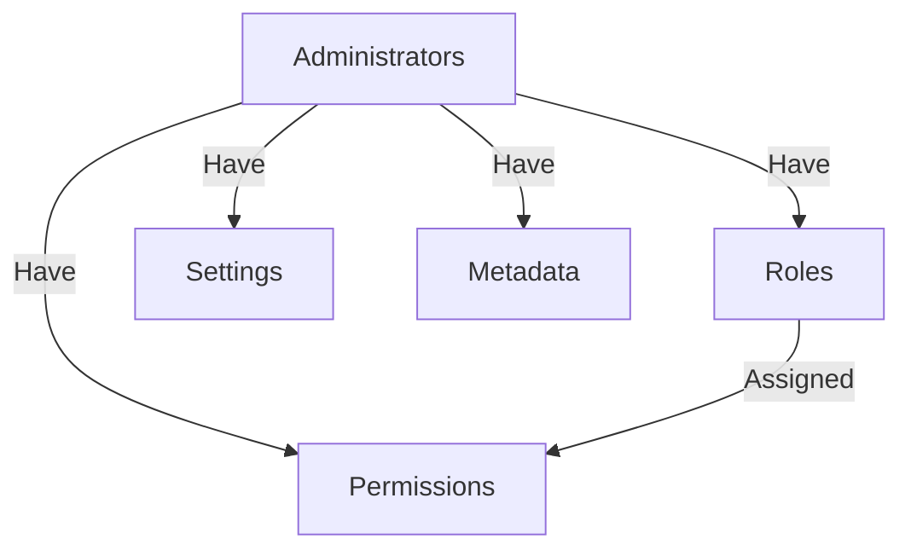

# Administrators

## Overview

StreamWise platform allows you to create admins users to manage the system. These users will have access to administrative resources and functionality, as well access to API private endpoints depending on the role assigned to them.

Administrators have a set of permissions that determine what they can do within the system. Permissions are grouped into **roles**, and admins can have one or more roles associated with them.



Admin users have their structure and administration independent of the structure of users who use the platform, as well as their authentication process.

:::note

Refer to [API Authentication](/docs/api/authentication) for more information about authentication process.

:::

## Admin Properties

Administrators have a set of properties that define them. This properties are used to identify the administrator and to define how the administrator interacts with the platform.

### Admin Attributes

Below is a list of all the properties that an administrator can have.

```json
{
  "object": "Admin",
  "id": "pEGXxmeyPkq25wlM",
  "uuid": "9a948601-d895-477a-9493-8311eb0d0822",
  "ulid": "01hewthykwj184v1qc50nynp8n",
  "first_name": "Joao",
  "last_name": "Mckein",
  "full_name": "Joao Mckein",
  "username": "Shilling",
  "email": "organized@eunarede.com",
  "status": "active",
  "locale": "pt_BR",
  "timezone": "America/Sao_Paulo",
  "admin_settings": [],
  "admin_metadata": [],
  "email_verified_at": null,
  "has_email_verified": false,
  "created_at": "2023-11-10T14:35:41.000000Z",
  "updated_at": "2023-11-10T20:52:00.000000Z"
}
```

| Parameter            | Type      | Description                                          |
|:---------------------|:----------|:-----------------------------------------------------|
| `object`             | `string`  | The object type. Always `Admin`.                     |
| `id`                 | `string`  | The admin ID.                                        |
| `uuid`               | `string`  | The admin UUID.                                      |
| `ulid`               | `string`  | The admin ULID.                                      |
| `first_name`         | `string`  | The admin first name.                                |
| `last_name`          | `string`  | The admin last name.                                 |
| `full_name`          | `string`  | The admin full name.                                 |
| `username`           | `string`  | The admin username.                                  |
| `email`              | `string`  | The admin email address.                             |
| `status`             | `string`  | The admin status.                                    |
| `locale`             | `string`  | The admin user locale. Default to system locale.     |
| `timezone`           | `string`  | The admin user timezone. Default to system timezone. |
| `admin_settings`     | `array`   | The admin settings.                                  |
| `admin_metadata`     | `array`   | The admin metadata.                                  |
| `email_verified_at`  | `string`  | The admin email verified at date.                    |
| `has_email_verified` | `boolean` | The admin email verified status.                     |
| `created_at`         | `string`  | The admin creation date.                             |
| `updated_at`         | `string`  | The admin last update date.                          |

#### Object

The admin `object` is the object type. It will always be `Admin`.

#### ID

The admin `id` is a unique identifier for the admin used internally by the platform to identify the admin.

#### UUID

The admin `uuid` is a unique identifier for the admin used internally by the platform to identify the admin.

#### ULID

The admin `ulid` is a unique identifier for the admin used internally by the platform to identify the admin.

#### First Name

The admin `first_name` is the admin first name.

#### Last Name

The admin `last_name` is the admin last name.

#### Full Name

The admin `full_name` is the admin full name.

#### Username

The admin `username` is the admin username. Is used to identify perform authentication.

:::info

Usernames are unique and cannot be changed after creation.

:::

#### Email

The admin `email` is the admin email address.

:::caution
Administrators email address can not be changed after creation.
:::

#### Status

The admin `status` is the admin status. Can be one of the following values:

* `active` - The admin is active and can access the platform.
* `inactive` - The admin is inactive and cannot access the platform.

#### Locale

The admin `locale` is the admin user locale. Default to system locale.

#### Timezone

The admin `timezone` is the admin user timezone. Default to system timezone.

### Admin Settings

The admin `admin_settings` is an array of settings that can be used to store any information about the admin. This settings are used to store information about the admin that is not part of the admin properties.

### Admin Metadata

The admin `admin_metadata` is an array of metadata that can be used to store any information about the admin. This metadata are used to store information about the admin that is not part of the admin properties.

## Admin Authorization

StreamWise platform provides a Role-Based Access Control (RBAC) through its Authorization mechanism. This means that you can define what each admin user can do within the system by assigning them to a role.

### Admin Permissions

Administrators have a set of permissions that determine what they can do within the system. Each permission allows the administrator to perform a specific action or access a specific resource.

Permissions are assigned to roles, and roles are assigned to administrators. This means that you can assign a permission to a role and all administrators with that role will have that permission.

The platform has a set of predefined permissions that you can use to create your own roles. The list with all permissions can be got from the API endpoint `GET /permissions`.

```json
{
  "data": [
    {
      "object": "Permission",
      "id": "dvb3g5KE5KYWBDz0",
      "name": "access-dashboard",
      "description": "Access the admins dashboard.",
      "display_name": "Access Dashboard",
      "guard_name": "api"
    }
  ]
}
```

| Parameter      | Type     | Description                                  |
|:---------------|:---------|:---------------------------------------------|
| `object`       | `string` | The object type. Always `Permission`.        |
| `id`           | `string` | The permission ID.                           |
| `name`         | `string` | The permission name.                         |
| `description`  | `string` | The permission description.                  |
| `display_name` | `string` | The permission display name.                 |
| `guard_name`   | `string` | The permission guard name. Default to `api`. |

#### Object

The permission `object` is the object type. It will always be `Permission`.

#### ID

The permission `id` is a unique identifier for the permission used internally by the platform to identify the permission.

#### Name

The permission `name` is a unique identifier for the permission used internally by the platform to identify the permission.

#### Description

The permission `description` is a human-readable description of the permission.

#### Display Name

The permission `display_name` is a human-readable name of the permission.

#### Guard Name

The permission `guard_name` is the name of the guard that the permission belongs to. The platform uses the `api` guard for all permissions.

### Admin Roles

The administrator roles allow you to fine tune exactly what each of your admin users can do within the platform. Administrator roles allow you to set the permissions for different types of admins.

You can set up as many different administrator roles as you want and then assign your admins to them. This allows you to have different levels of access for different admins.

```json
{
  "object": "Role",
  "id": "dvb3g5KE5KYWBDz0",
  "name": "admin",
  "description": "Administrator Role",
  "display_name": "Administrator",
  "guard_name": "api",
  "created_at": "2023-11-09T19:20:44.000000Z",
  "updated_at": "2023-11-09T19:20:44.000000Z",
  "readable_created_at": "há 1 mês",
  "readable_updated_at": "há 1 mês"  
}

```

| Parameter      | Type     | Description                            |
|:---------------|:---------|:---------------------------------------|
| `object`       | `string` | The object type. Always `Role`.        |
| `id`           | `string` | The role ID.                           |
| `name`         | `string` | The role name.                         |
| `description`  | `string` | The role description.                  |
| `display_name` | `string` | The role display name.                 |
| `guard_name`   | `string` | The role guard name. Default to `api`. |
| `created_at`   | `string` | The role creation date.                |
| `updated_at`   | `string` | The role last update date.             |

#### Object

The `object` parameter is the object type. It will always be `Role`.

#### ID

The `id` parameter is the role ID. It is a unique identifier for the role used internally by the platform to identify the role.

#### Name

The `name` parameter is the role name. It is used to identify the role in the platform.

:::note

Names are unique and cannot be changed after creation.

:::

#### Description

The `description` parameter is a human-readable description of the role.

#### Display Name

The `display_name` parameter is a human-readable name of the role.

#### Guard Name

The `guard_name` parameter is the name of the guard that the role belongs to. The platform uses the `api` guard for all roles.

## Administrators Management


### Listing Admins

The list of admins includes all the admins registered on the platform. This list includes each admin's name, email address, username, admin role, and any other details you've added to the admin's profile.

Admins list can be performed by authenticated administrators with the right permissions through the API endpoint `GET /admins`.

### Creating Admins

Admin creation can be performed by authenticated administrators with the right permissions through the API endpoint `POST /admins`.

### Updating Admins

Admin update can be performed by authenticated administrators with the right permissions through the API endpoint `PATCH /admins/{admin_id}`.

### Deleting Admins

Admin deletion can be performed by authenticated administrators with the right permissions through the API endpoint `DELETE /admins/{admin_id}`.

### Assign Admin to Role

Assigning an admin to a role can be performed by authenticated administrators with the right permissions through the API endpoint `POST /roles/assign`.

```json
{
  "admin_id": "pEGXxmeyPkq25wlM",
    "roles_ids": [
        "pEGXxmeyPkq25wlM",
        "Nba1rYkOBKVXzmx7"
    
    ]
}
```

Send a JSON object with the following parameters:

| Parameter   | Type     | Description                                                |
|:------------|:---------|:-----------------------------------------------------------|
| `admin_id`  | `string` | **Required**. The ID of the admin to assign the role to.   |
| `roles_ids` | `array`  | **Required**. An array of role IDs to assign to the admin. |

:::info

Assign a new role to admin will preserve any other roles already assigned to then.

:::

### Revoke Role from Admin

Revoking a role from an admin can be performed by authenticated administrators with the right permissions through the API endpoint `POST /roles/revoke`.

```json
{
  "admin_id": "pEGXxmeyPkq25wlM",
    "roles_ids": [
        "pEGXxmeyPkq25wlM",
        "Nba1rYkOBKVXzmx7"
    
    ]
}
```

> JSON object is the same as the one used for assigning roles to admins.

Revoking a role from an admin will have imediate effect on the admin.

### Sync Admin Roles

Sync admin roles is the best way if you need to **revoke all existing roles** from an admin and **assign a new set** to them.

Syncing admin roles can be performed by authenticated administrators with the right permissions through the API endpoint `POST /roles/sync`.

```json
{
  "admin_id": "pEGXxmeyPkq25wlM",
    "roles_ids": [
        "pEGXxmeyPkq25wlM",
        "Nba1rYkOBKVXzmx7"
    
    ]
}
```

:::caution

Syncing admin roles will **revoke all existing roles** from the admin and **assign a new set** to them.

:::

## Roles Management

The administrator roles allow you to fine tune exactly what each of your admin users can do within your SaaS Video Streaming Resell Platform administration area. Administrator roles allow you to set the permissions for different types of admins.

You can set up as many different administrator roles as you want and then assign your admins to them. This allows you to have different levels of access for different admins.

:::info
The system include a default administrator role called **admin** with **full access** to all areas of the platform administration area and resources. **This role cannot be edited or deleted**.
:::

### Listing Roles

Listing roles can be performed by authenticated administrators with the right permissions through the API endpoint `GET /roles`.

### Creating Roles

Creating roles can be performed by authenticated administrators with the right permissions through the API endpoint `POST /roles`.

```json
{
    "name": "admin",
    "display_name": "Administrator",
    "description": "Administrator role with full access to all areas."
}
```

:::tip
For all admin roles, you **must** enable **access-dashboard** permission. This allows the admin to see main parts of the dashboard.
:::

:::caution Unauthorized Access

Many **Create** and **Update** permissions require the related **Read** permission. If you see **Unauthorized Access** errors, add the **Read** permission. For example, errors will occur for **Create Room** if you don't also enable **Read Rooms**.

:::

### Updating Roles

Updating roles can be performed by authenticated administrators with the right permissions through the API endpoint `PATCH /roles/{role_id}`.

### Deleting Roles

Deleting roles can be performed by authenticated administrators with the right permissions through the API endpoint `DELETE /roles/{role_id}`.

### Attaching Permissions to Roles

Permissions are assigned to roles, and roles are assigned to administrators. This means that you can assign a permission to a role and all administrators with that role will have that permission. Roles can have as many permissions needed.

Attaching permissions to roles can be performed by authenticated administrators with the right permissions through the API endpoint `POST /permissions/attach`.

```json
{
    "role_id": "pEGXxmeyPkq25wlM",
    "permissions_ids": [
        "pEGXxmeyPkq25wlM",
        "Nba1rYkOBKVXzmx7"
    ]
}
```

Send a JSON object with the following parameters:

| Parameter         | Type     | Description                                                     |
|:------------------|:---------|:----------------------------------------------------------------|
| `role_id`         | `string` | **Required**. The ID of the role to attach the permissions to.  |
| `permissions_ids` | `array`  | **Required**. An array of permission IDs to attach to the role. |


:::caution Permission Assignment

It is only possible assign permissions to roles. You cannot assign permissions directly to administrators.

:::

### Detaching Permissions from Roles

Permissions can be detached from roles by authenticated administrators with the right permissions through the API endpoint `POST /permissions/detach`.

```json
{
    "role_id": "pEGXxmeyPkq25wlM",
    "permissions_ids": [
        "pEGXxmeyPkq25wlM",
        "Nba1rYkOBKVXzmx7"
    ]
}
```

> JSON object is the same as the one used for attaching permissions to roles.

Detaching a permission from a role will have imediate effect on all administrators with that role.

### Sync Permissions on Role

Syncing permissions on role is the best way if you need to **detach all existing permissions** from a role and **attach a new set** to it. Syncing permissions on role can be performed by authenticated administrators with the right permissions through the API endpoint `POST /permissions/sync`.

```json
{
    "role_id": "pEGXxmeyPkq25wlM",
    "permissions_ids": [
        "pEGXxmeyPkq25wlM",
        "Nba1rYkOBKVXzmx7"
    ]
}
```

:::caution

Syncing permissions on role will **detach all existing permissions** from the role and **attach the new set** to it.

:::