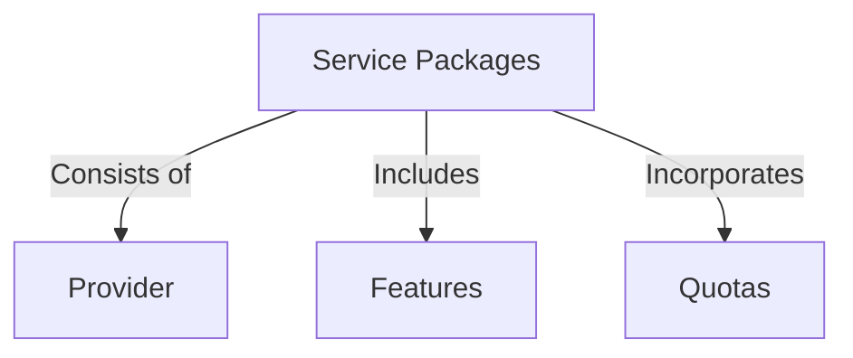

# Service Packages

## Overview

Service Packages serve as the foundation of our platform, defining the specific goods or services that you offer to your valued customers. Each Service Package delineates the service available for subscription and the associated resources.

A Service Package consists of the **Provider**, which denotes the service provided to the customer. This can encompass various offerings such as video streaming, web meeting services, or any other service tailored to your customers' needs. (Refer to [Service Providers](/docs/service-providers) for more information.)

Additionally, Service Packages include a detailed breakdown of **Features**. These are the functionalities and capabilities available to subscribers upon service activation. Whether it's advanced video streaming options, comprehensive web meeting features, or other service-specific functionalities, Service Packages outline what customers can expect from their subscription.

Furthermore, Service Packages incorporate **Quotas** that represent the limits or allowances associated with the service. Quotas ensure efficient resource allocation and management, allowing you to effectively control and monitor usage within predefined limits.

With the flexibility of our platform, you have the capability to create multiple Service Packages, each offering distinct features and quotas. This enables you to cater to diverse customer needs and preferences effectively. For instance, you may choose to provide Standard and Premium packages, each offering unique features and quotas tailored to different customer segments.

## Service Packages

> Service Package describe the specific goods or services you offer to your customers.

A Service Package defines the service that a customer can subscribe and the resources that will be available. It can be a video streaming service, a web meeting service, or any other service that you want to offer to your customers.

Service Packages are composed of:

- **Provider**: The service that will be provided to the customer. It can be a video streaming service, a web meeting service, or any other service that you want to offer to your customers. See [Service Providers](/docs/service-providers).
- **Features**: The features that are available to the customer when they subscribe to the service.
- **Quotas**: The quotas that are available to the customer when they subscribe to the service.

You can create multiple Service Packages with different features and quotas that will be available for subscription by your customers. For example, you might offer a Standard and Premium package, with different features and quotas.

## Package Properties

### Package Types

The platform supports the following package types:

* **meet**: Web Meeting.
* **live**: Live Streaming.
* **video**: On Demand Video.
* **webinar**: Webinar.
* **webcast**: Webcast.
* **simulcast**: Simulcast.
* **phone**: Phone Conference.
* **audio**: Audio Conference.
* **audcast**: Audio Broadcast.

### Grace Period {#grace-period}

> work in progress

### Trial Period {#trial-period}

> work in progress

### Periodicity {#periodicity}

> work in progress

### Package Attributes

The following table describes the available attributes of a Service Package.

| Property                 | Type    | Description                                                                 |
|--------------------------|---------|-----------------------------------------------------------------------------|
| id                       | string  | The unique identifier of the service package.                               |
| uuid                     | string  | The Universally Unique Identifier of the service package.                   |
| ulid                     | string  | The universally unique lexicographically identifier of the service package. |
| name                     | string  | The name of the service package.                                            |
| service_type             | string  | The type of service that the package provides.                              |
| status                   | enum    | The status of the service package.                                          |
| hidden                   | boolean | Indicates if the service package is hidden.                                 |
| retired                  | boolean | Indicates if the service package is retired.                                |
| description              | string  | The description of the service package.                                     |
| short_description        | string  | The short description of the service package.                               |
| has_stock                | boolean | Indicates if the service package has stock.                                 |
| stock_qty                | integer | The quantity of stock available for the service package.                    |
| overages_enabled         | boolean | Indicates if the service package allows overages.                           |
| oversell_enabled         | boolean | Indicates if the service package allows oversell.                           |
| price                    | float   | The price of the service package.                                           |
| signup_fee               | float   | The signup fee of the service package.                                      |
| currency                 | string  | The currency of the service package.                                        |
| tier                     | string  | The tier of the service package.                                            |
| trial_period             | integer | The trial period of the service package.                                    |
| trial_interval           | string  | The trial interval of the service package.                                  |
| trial_mode               | string  | The trial mode of the service package.                                      |
| grace_period             | integer | The grace period of the service package.                                    |
| grace_interval           | string  | The grace interval of the service package.                                  |
| periodicity              | integer | The periodicity of the service package.                                     |
| periodicity_type         | string  | The periodicity type of the service package.                                |
| notification_preferences | array   | The notification preferences of the service package.                        |
| package_settings         | array   | The package settings of the service package.                                |
| package_metadata         | array   | The package metadata of the service package.                                |

## Service Features

Service features are the matrix of resources available to set, consume and charge over. They serve as source of truth for the platform to manage the features that can be defined upon other resources like service packages, service providers, subscriptions, and others.

:::info

Features are managed by the platform and can't be created or updated.

:::

The platform has a predefined set of features that can be used to specify the resources that will be available to the customer when they subscribe to a service package or for a service provider to specify what features are available, for example.

Service Feature can have their use extended, such as enabling an external application to list the available resources, their identifiers and values and associate this information in its internal system for usage and billing control.

### Service Feature Attributes {#service-feature-attributes}

Service Features are composed by attributes that define the feature. The following table describes the available attributes.

| Attribute        | Type            | Description                                                                                                                         |
|------------------|-----------------|-------------------------------------------------------------------------------------------------------------------------------------|
| name             | string          | The name of the feature.                                                                                                            |
| code             | string          | Unique code used to identify the feature associated with the API request. This code associates each event with the correct feature. |
| field_suffix     | string          | Property of the feature used for aggregating usage data. This field is not required for `count_agg`.                                |
| aggregation_type | enum \<string\> | The type of aggregation used for the feature. Possible values are `count_agg`, `sum_agg`, `max_agg` or `unique_count_agg`.          |
| description      | string          | The description of the feature.                                                                                                     |
| consumable       | boolean         | Indicates if the feature is consumable. If `true`, the feature will be consumed when the customer uses the resource.                |
| quota            | boolean         | Indicates if the feature is a quota. If `true`, the feature will be used to limit the customer usage of the resource.               |
| periodicity_type | enum \<string\> | The type of periodicity for the feature. Possible values are `daily`, `weekly`, or `monthly`.                                       |
| periodicity      | integer         | The periodicity value for the feature. Indicates how often the feature will be reset based on the periodicity type.                 |
| feature_settings | object          | The feature settings.                                                                                                               |
| feature_metadata | object          | The feature metadata.                                                                                                               |

#### Name

Human-readable name of the feature.

#### Code

Unique code used to identify the feature associated with the API request. This code associates each event with the correct feature.

#### Field Suffix

Property of the feature used to specify a unit of measure for the feature. This field is not required for `count_agg`.

#### Aggregation Type

The type of aggregation used for the feature. Possible values are `count_agg`, `sum_agg`, `max_agg` or `unique_count_agg`.

#### Description

Human-readable description of the feature.

#### Consumable

Indicates if the feature is consumable. If `true`, the feature will be consumed when the customer uses the resource. A consumable feature is a feature that can be incremented or decremented based on the customer usage of the resource.

#### Quota

Indicates if the feature is a quota. If `true`, the feature will be used to limit the customer usage of the resource. Features that indicate quota can have your usage limited to a specific amount.

#### Periodicity Type

The type of periodicity for the feature. Possible values are `daily`, `weekly` or `monthly`. The periodicity type indicates how often the feature will be reset. If a feature is consumable, it will be reset based on the periodicity type.

#### Periodicity

The periodicity value for the feature. Indicates how often the feature will be reset based on the `periodicity_type`. For example, if the `periodicity_type` is `monthly` and the `periodicity` is `1`, the feature will be reset every month.

#### Feature Settings

The feature settings.

#### Feature Metadata

The feature metadata.

### Available Features

Available service features can vary depending on platform version or license type. You can use the API resource `GET /features` to list all available features.

## Package Features {#package-features}

Package Features are the specific resources or services that a customer can access or consume when they subscribe to a Service Package. Each feature represents a unique aspect of the service that the customer can utilize. For instance, a feature could represent the maximum number of participants that can join a meeting, or the maximum number of minutes that a customer can use for a web meeting.

Each Service Package can include multiple features, with each one representing a different resource that the customer can consume or access. It's important to note that each package can only have one feature of each type, and these are uniquely identified by the feature code.

### Defining Package Features

When defining features for a Service Package, consider the following:

- **Identify the Resources**: Determine what resources or services the customer will be able to access or consume when they subscribe to the package.
- **Define the Limits**: For each resource, define the limits or allowances. This could be the maximum number of participants for a meeting, the maximum number of minutes for a web meeting, etc.
- **Assign a Unique Feature Code**: Each feature should have a unique code for identification purposes.

### Managing Package Features

Managing package features involves adding, updating, or removing features from a Service Package. This can be done through the platform's management interface or API.

Remember, the goal of defining and managing package features is to create Service Packages that meet the diverse needs and preferences of your customers. By offering packages with different features, you can cater to a wider customer base and provide more value to your customers.

## Package Providers

> work in progress

Package Providers are the providers that are available to the customer when they subscribe to a service.

:::info
See [Package Providers](/docs/administration/service-packages#providers) for more information about providers.
:::

## Packages Management

> work in progress

Service Packages management documentation is divided into different sections that describes in detail the components of a Service Package and how to manage them.

