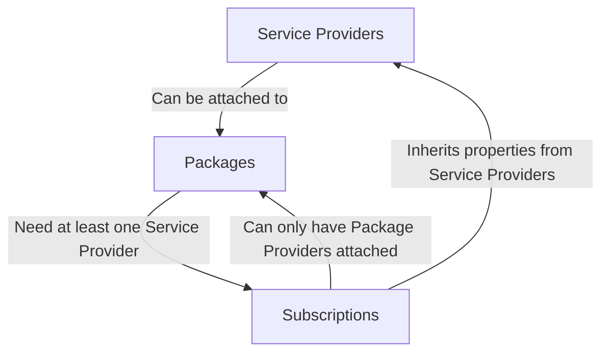

# Service Providers

> work in progress

## Overview

The Service Providers feature empowers you to effectively manage third-party providers within the StreamWise platform, offering a diverse array of services through Service Packages and Subscriptions. Each Service Provider is equipped with a customizable set of configuration options, defining unique properties and capabilities tailored to your needs.

Service Providers play a pivotal role in the platform, facilitating the management of diverse providers to cater to the varied needs of your clientele. Each provider comes with its own distinct properties, settings, and metadata. These providers can seamlessly integrate with different service packages and subscriptions, enhancing flexibility and customization.

With StreamWise, you have the flexibility to configure multiple service providers, enabling you to deliver a wide range of video, streaming, and web meeting services while maintaining vendor independence. This capability empowers you to meet the diverse needs of your customers efficiently and effectively.

:::info

For a extensive list of available providers,  please refer to the [Service Providers](/docs/service-providers/) section.

:::

## Hierarchical Structure

In the StreamWise platform, the hierarchical structure of service providers is a fundamental concept that underpins the organization and functionality of the system. This structure is primarily based on the relationships between service providers, packages, and subscriptions.

At the core of this hierarchy are the service providers. These entities offer a diverse array of services and are equipped with a customizable set of configuration options, defining unique properties and capabilities tailored to your needs. Each service provider can seamlessly integrate with different service packages and subscriptions, enhancing flexibility and customization.

Service packages and subscriptions form the next level of the hierarchy. They are dependent on service providers and require at least one service provider to function properly. These packages and subscriptions encapsulate the services offered by the providers and present them to the end-users in a structured and manageable way.

Subscriptions represent the final level of the hierarchy. They can only have package providers attached, further emphasizing the hierarchical relationship between service providers, packages, and subscriptions.

Understanding this hierarchical structure is crucial for managing and configuring the StreamWise platform effectively. It allows for a clear overview of how services are organized and how they interact with each other, providing a solid foundation for efficient service delivery and management.

## Service Types {#service-types}

A third-party service provider will always be associated with a service type. The service type defines the type of service that the service provider provides. For example, _BigBlueButton_ is a service provider that offers web meeting services, while _Cloudflare Stream_ is a service provider that offers video streaming services.

The StreamWise platform supports the following types of services:

| Service Type            | Value  | Description                             |
|-------------------------|--------|-----------------------------------------|
| [Web Meeting](#meet)    | `meet` | Used for web meeting service providers. |

### Web Meeting {#meet}

The Web Meeting service type is used for service providers that offer web meeting services. Service providers that offer web meeting services can be used to create meeting rooms, manage users, manage recordings, etc.

Web meeting service providers can be identified by the value `meet` in the `service_type` attribute of the `ServiceProvider` object.

* Key: `service_type`
* Value: `meet`

:::note
At moment, the only supported `service_type` is `meet`.

:::

## Provider Types {#provider-types}

A third-party service provider will always be associated with one type of provider. The provider type specifies which provider is being used to provide the service. The platform supports specific providers for each type of service with their own settings and properties. Who will define which properties and settings will be available for each type of provider will be the **Provider Type**.

The Provider Types currently supported by the platform are:

| Provider Type | Value       | Details                                                                                       |
|---------------|-------------|-----------------------------------------------------------------------------------------------|
| BigBlueButton | `bbb`       | Access [BigBlueButton Provider](/docs/service-providers/bigbluebutton) reference for details. |
| Scalelite     | `scalelite` | Access [Scalelite Provider](/docs/service-providers/scalelite) reference for details.         |

## Service Provider Properties

A Service Provider is a resource that has different properties that can be configured. The properties are used to define the behavior of the service provider. In this section, we will cover the properties that are available for a service provider.

### Attributes

Below is a list of the properties that are available for a service provider.

| Attribute     | Type    | Description                                                                  |
|---------------|---------|------------------------------------------------------------------------------|
| id            | Integer | The unique identifier of the service provider.                               |
| uuid          | String  | The Universally Unique Identifier of the service provider.                   |
| ulid          | String  | The universally unique lexicographically identifier of the service provider. |
| provider_name | String  | The name of the service provider.                                            |
| active        | Boolean | The status of the service provider.                                          |
| provider_type | Enum    | The type of provider that is being used to provide the service.              |
| service_type  | Enum    | The type of service that the service provider provides.                      |
| properties    | Array   | The properties of the service provider.                                      |
| settings      | Array   | The settings of the service provider.                                        |
| metadata      | Array   | The metadata of the service provider.                                        |

#### id

The `id` is the unique identifier of the service provider. The `id` is a hashed key that is automatically generated by the platform.

#### uuid

The `uuid` is the Universally Unique Identifier of the service provider. The `uuid` is generated by the platform and is unique across all service providers.

#### ulid

The ULID is a universally unique lexically sortable identifier. The ULID is generated by the platform and cannot be changed. The ULID provide a canonically encoded 26 character string that can be used to sort the room in chronological order (due to the time component of the ULID) or to generate time-based shard keys (due to the randomness of the ULID).

#### provider_name

The `provider_name` is a human-readable name of the service provider. The `provider_name` is used to easily identify the service provider in the platform and can be changed at any time.

#### active

The `active` is a boolean value that indicates whether the service provider is active or not. The `active` attribute can be used to disable a service provider without deleting it. Provedores de servico que estejam desabilitados nao estarao disponiveis para utilizacao mesmo que já associados a pacotes ou assinaturas. 

:::caution

If the service provider is set as `default` in any [package](/docs/administration/service-packages) or [subscription](/docs/administration/subscriptions) provider, you can't disable it. Trying to disable a default service provider will return an error.

:::

#### provider_type

The `provider_type` is the type of provider that is being used to provide the service. The provider type specifies which provider is being used to provide the service.

:::note

Please refer to the [Provider Types](#provider-types) section for more information.

:::

#### service_type

The `service_type` is the type of service that the service provider provides. The service type specifies which service the service provider provides.

:::note

Please refer to the [Service Types](#service-types) section for more information.

:::

### Properties

The `properties` is a key-value pairs that store additional structured data used internally to configure additional information attached to a service provider. The properties are used to store the configuration of the service provider like credentials, hostnames, etc.

The properties that will be set for a service provider will depend on the provider type. Each provider has its own required properties.

:::info

Please refer to the [**Provider Types**](#provider-types) section for more information about the required properties for each provider type.

:::

:::tip Sensitive Data

Any sensitive properties data, such as credentials, are **encrypted before being stored** in the database. The encryption is made using the most advanced encryption algorithms available and all stored data only can be decrypted by the platform.

:::

### Settings

The `settings` is a key-value pairs that store additional structured data used internally to configure additional information attached to a service provider. The settings are used to define the behavior of the service provider.

:::note

At moment, no settings are available for a service provider.

:::

### Metadata

The `metadata` is a set of key-value pairs that can attached to a service provider. This can be useful for storing additional information or third-party data, such as identification from a CRM system or billing system.

The metadata is stored as a JSON object. The keys are strings and the values can be strings, numbers, booleans, or null.

| Key                               | Type    | Value | Description            |
|-----------------------------------|---------|-------|------------------------|
| `metadata['external_billing_id']` | integer | `123` | Third-party billing id |
| `metadata['external_crm_id']`     | integer | `456` | Third-party CRM id     |

:::note

This is an example of how to set the `metadata` attribute. The `metadata` attribute can be set to any key-value pair.

:::

## Service Providers Management

The StreamWise platform provides a RESTful API to manage service providers. The API allows you to create, list, update, and delete service providers. An administrator with the proper permissions can manage the service providers through the API.

:::info

Please refer to the [API Reference](/docs/api) section for more information about the Service Providers API.

:::

### Create a Service Provider

Service Providers can be created using the `POST /service-providers` API endpoint. The endpoint will create a new service provider with the specified attributes.

Depending on the provider type, the service provider will have different attributes. Please refer to the [Provider Types](#provider-types) section for more information about the required attributes for each provider type.

### List Service Providers

Service Providers can be listed using the `GET /service-providers` API endpoint. The endpoint will return a list of service providers and their attributes.

### Update a Service Provider

Service Providers can be updated using the `PATCH /service-providers/{id}` API endpoint. The endpoint will update the service provider with the new attributes.

### Delete a Service Provider

Service Providers can be deleted using the `DELETE /service-providers/{id}` API endpoint. The endpoint will delete the service provider and all associated data.

:::caution

A Service Provider cannot be deleted if it is associated with any package or subscription. If you try to delete a service provider that is associated with a package or subscription, the platform will return an error.

:::