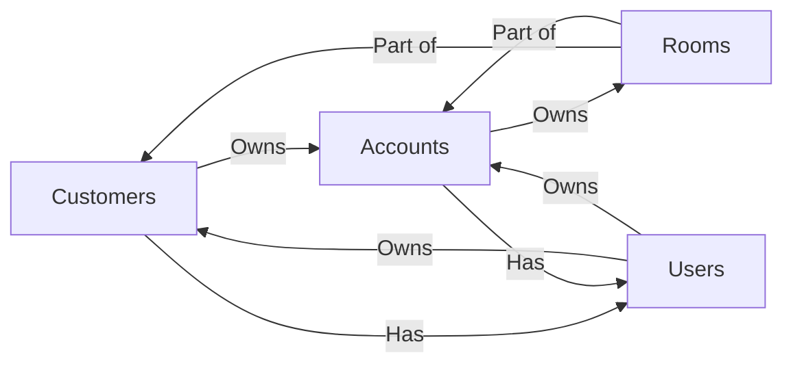

# Getting Started

## Introduction

Welcome to the SaaS Video Streaming Resell System! This section will help you get started with the platform by covering the basics of administration, logging in, and navigating the platform's resources.

## Logging In to the Platform

### Dashboard

To log in to the platform, simply navigate to the login page and enter your administration account credentials. Once you've logged in, you'll be taken to the administration dashboard.

### API Credentials

The platform uses API credentials to authenticate requests to the API. To create API credentials, navigate to the **API Credentials** page and click the **Create API Credentials** button. This will prompt you to enter the following information:

- **Name** - The name of the API credentials.
- **Description** - The description of the API credentials.
- **Permissions** - The permissions of the API credentials.
- **Expiration Date** - The expiration date of the API credentials.

Once you've entered the required information, the API credentials will be created, and you'll be able to use them to authenticate requests to the API.

## Navigating the Platform

### Administration Dashboard

The Administration Dashboard is the portal that admins access when they work within PaaS Video Streaming Resell Platform. The PaaS Video Streaming Resell Platform Administration Dashboard has interfaces and feature pages, each often containing multiple sub-interfaces.

You can access the Admin Area by following the steps below to log in as an admin. Then, use the navigation tools to find the PaaS Video Streaming Resell Platform features you want to use.

## Entities

SaaS Video Streaming Resell Platform is a multi-tenant platform, which means that multiple customers can use the same platform instance. Each customer has their own accounts, rooms, users, and API credentials.

The platform is built around the following entities:

* [Customers](#customers)
* [Accounts](#accounts)
* [Users](#users)
* [Rooms](#rooms)

### Customers {#customers}

Customers are the top-level entities in the system, they represent a billable party, like a business or person. Customers can own multiple accounts and rooms, and each customer can have multiple users associated with it.

:::info
You can find more information about customers in the [Customers](/docs/administration/customers) section.
:::

### Accounts {#accounts}

Accounts are the second-level entities in the system. Accounts are associated with a single customer, and this customer has all privileges over the account. Accounts can have multiple users associated with them. Each account can have only one owner defined and as default the owner is user who was created with the account or first associated upon creation.

Accounts represent a specific service, like a video streaming service or web meeting service. Each account can have different types of resources associated with it, like rooms, users, recordings, etc.

:::info
You can find more information about accounts in the [Accounts](/docs/administration/accounts) section.
:::

### Users {#users}

Users are the third-level entities in the system. Users represent a person who can access the platform and use or manage the services. Users can be associated with multiple customers or accounts, and each user can have multiple roles based on each permission granted and type of access for different customers and accounts. 

Each user can own different customers and accounts. Each user can have multiple roles associated with it.

:::info
You can find more information about users in the [Users](/docs/administration/users) section.
:::

### Rooms {#rooms}

Rooms are the fourth-level entities in the system. Rooms represent a specific meeting or conference. Rooms can be associated with multiple customers or accounts, and each room can have multiple users associated with it.

:::info
You can find more information about rooms in the [Rooms](/docs/administration/rooms) section.
:::